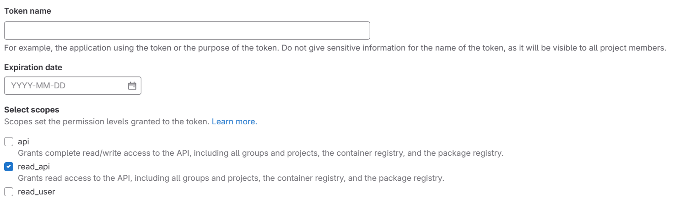

# Gitlab Repository Clone

## Author

**Name**: Ismaël Maurice

**Github**: https://github.com/tisma95

**Email**: ismael.tuo@edigrp.com <br>

## Description

This repository goal is to clone all repositories of gitlab associate to the user:
 + the personal user repositories private and public,
 + the user organization repositories,
 + the fork repositories.

If the repository existed pull to update will be.

Clone all branchs in folder.

## Requirement

Before starting the project you need to install on your computer the following packages:

[Python >=3.9](https://www.python.org/downloads/)

[Git](https://git-scm.com/book/en/v2/Getting-Started-Installing-Git)


## Started

Run the commands inside the folder:

1. If no **env** folder exists init the environment else skip this step
```cmd
    python -m venv env
```
or
```cmd
    python3 -m venv env
```
or for ubuntu
```cmd
    virtualenv venv
```

```node
    If any problem follow this page to fix and intall virutalenv: https://gist.github.com/frfahim/73c0fad6350332cef7a653bcd762f08d
```

2. If the env folder already exists, run the following command to activate it
```cmd
    source env/bin/activate
```
or for windows
```cmd
    env\Scripts\activate.bat
```

3 Run the installation of package via following command
```cmd
    pip install -r requirements.txt
```

1. Init the environment variable by following [Environment variables](#environment-variables)
2. Create the token on your **Gitlab** access only read access is required:

    

3. Run the script with command `python main.py` or `python3 main.py`

## Environment variables ##

Create the file **.env** inside folder with following example variable

```yaml
# Clone repo host
DOMAIN = gitlab.com
# Domain protocol type http or https
PROTOCOL = https
# Access Token To Domain
TOKEN = your_generate_token_here
# Username To Domain
USERNAME = your_gitlab_username
# Storage Folder => Folder where the repositories will be save => example /home/toto or C:\users\toto for windows
FOLDER = folder_path_here
```

## Other informations

+ If new package is install we can update the **requirements.txt** with command `pip freeze > requirements.txt` or `python3 -m pip freeze > requirements.txt`

+ Exit the env via: `deactivate` or for windows `env\Scripts\activate.bat`


## Useful packages

[Requests Documentation](https://requests.readthedocs.io/en/latest/user/quickstart/)

[Gitlab REST API Documentation](https://docs.gitlab.com/ee/api/rest/)

[python-dotenv Documentation](https://pypi.org/project/python-dotenv/)
